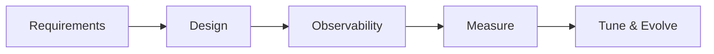
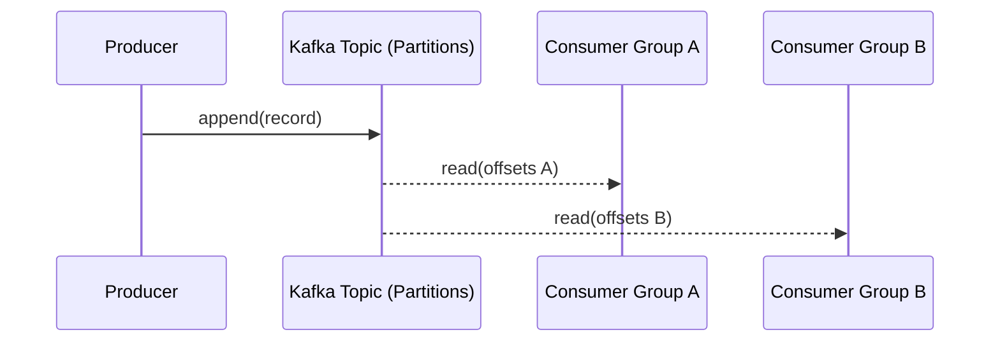
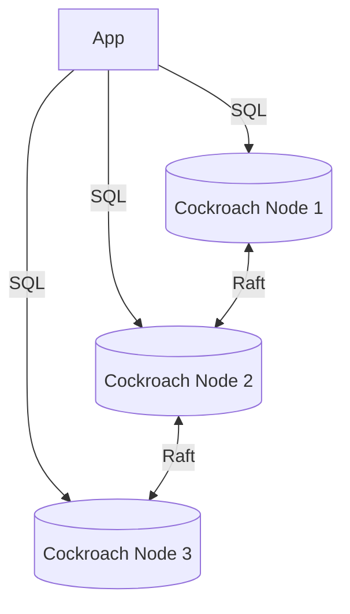
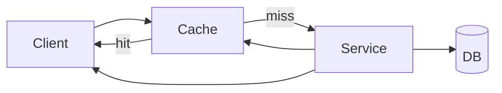
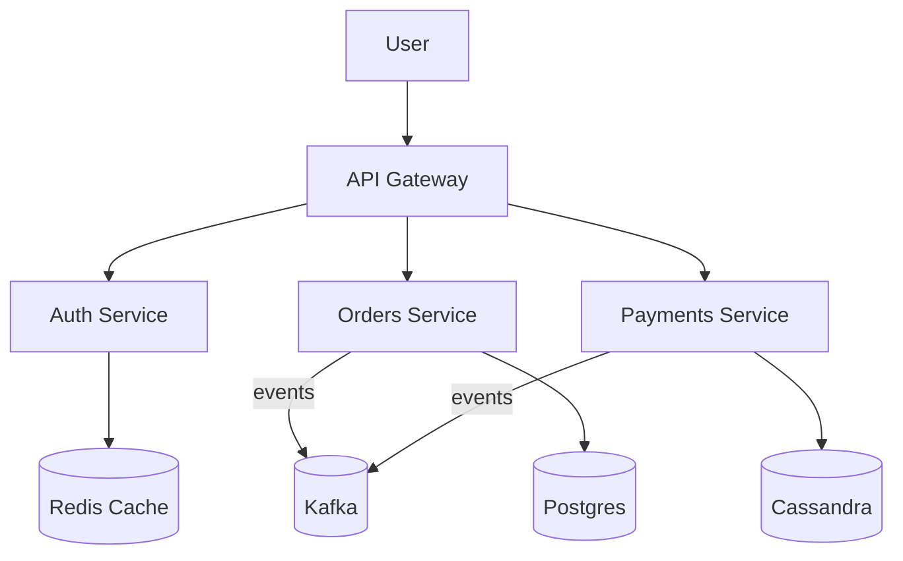
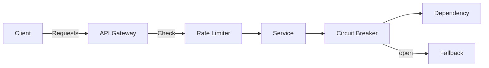
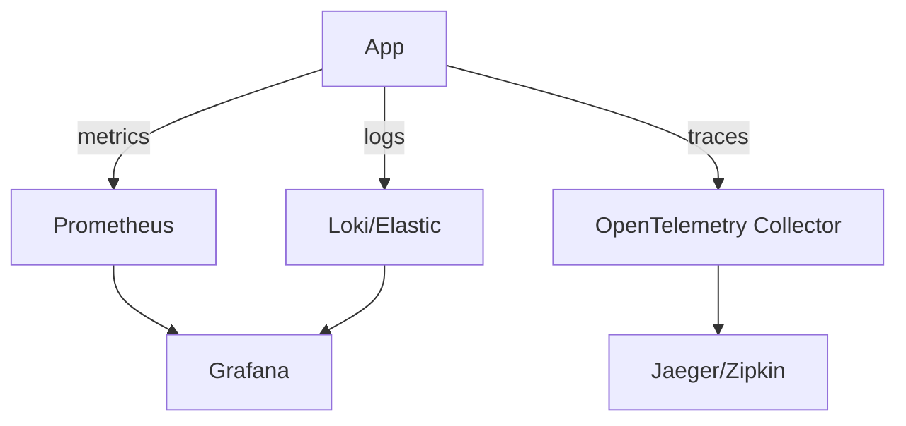
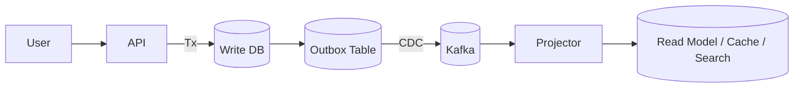

# 📘 System Design — Глубокий разбор (расширенный конспект с диаграммами)

> Версия: 1.0 • Фокус: практические объяснения, trade-offs, схемы и анти-паттерны.

---

## Оглавление
1. Введение и подход к системному дизайну
2. Событийный стриминг: Kafka, Pulsar, очереди vs логи
3. NoSQL: документные, ключ-значение, колонночные, графовые — когда и почему
4. Реляционные БД: масштабирование, репликация, шардинг, NewSQL
5. Кэширование: уровни, стратегии, TTL/eviction, hot keys, CDN/edge
6. Архитектурные стили: монолит, модульный монолит, микросервисы, EDA, serverless, гексагона
7. Масштабирование и отказоустойчивость: LB, CAP/PACELC, консистентность, multi-region
8. Надёжность и устойчивость: circuit breaker, bulkhead, retry/backoff, rate limiting
9. Observability: логи/метрики/трейсы, SLI/SLO, golden signals, sampling
10. Безопасность: аутентификация/авторизация, секреты, шифрование, Zero Trust, supply chain
11. Data patterns: CQRS, Event Sourcing, outbox/inbox, CDC, materialized views, CRDT
12. Проектирование на салфетке: оценки RPS/throughput/хранилище, расчёт кластера
13. Частые решения и карты соответствия (AWS/Azure/GCP)
14. Приложения: чек-листы, анти-паттерны, словарь терминов

---

## 1) Введение и подход

**System Design** — это баланс **консистентности**, **доступности**, **задержек**, **стоимости** и **простоты поддержки**. Нет «идеальных» решений — есть решения под **ваши SLO** и **нагрузку**.

- Начинаем с **требований**: RPS, p95/p99 latency, объём данных/сутки, допустимые потери/повторы, RPO/RTO, региональность.
- Проектируем **простую** схему, включаем **наблюдаемость**, измеряем, затем **эволюционируем** (evolutionary architecture).
- Везде закладываем **идемпотентность** и **восстанавливаемость** (replay, retry-safe).

---

## 2) Событийный стриминг (Kafka и др.) — «не очередь, а журнал»

### 2.1. Почему стриминг, а не классическая очередь
- **Очередь (RabbitMQ/SQS)**: сообщение исчезает после ACK, читается **одним** консюмером в группе. Хорошо для «сделай и забудь», RPC-подобных задач.
- **Лог (Kafka/Pulsar)**: событие хранится по **retention** и может быть перечитано **много раз** разными группами. Это база для **реплея**, аудит-трейлов, асинхронных проекций.

### 2.2. Сущности Kafka и порядок
- **Topic** → **Partitions** (шардирование и параллелизм).  
- **Key** определяет партицию (хэш). Все события с одинаковым ключом попадают **в одну партицию** → сохраняется **порядок по ключу**.
- **Replication factor (RF)** + **ISR** → надёжность и доступность партиций (leader/followers).
- **Offset** — монотонный номер записи в партиции, у каждого консюмера свой прогресс.

**Правило:** глобального порядка **нет** — только порядок **внутри партиции**. Если нужен порядок по `orderId` — используйте ключ `orderId`.

### 2.3. Гарантии доставки (semantics)
- **At-most-once**: commit до обработки → возможна потеря.  
- **At-least-once**: commit после обработки → **нет потерь**, но возможны дубликаты (**нужна идемпотентность**).  
- **Exactly-once (EOS)**: в контуре Kafka→Kafka с **идемпотентным продюсером** и **транзакциями** (пакетная запись + коммит offsets как атомарная операция). Для внешних sinks EOS недостижима без соглашений (используйте outbox/дедупликацию).

### 2.4. Продюсер: надёжность и скорость
- `acks=all` + `min.insync.replicas>=2` → запись подтверждена лидером и всеми ISR.  
- `enable.idempotence=true` → защита от дублирования при ретраях.  
- Транзакции → атомарная запись в несколько топиков/партиций + согласованный commit offsets.
- Производительность: `batch.size`, `linger.ms`, `compression.type=zstd/lz4`, достаточное число партиций.

### 2.5. Консюмер-группы, ребаланс, лаг
- Группа читает топик **параллельно**: одна партиция → один консюмер из группы.
- **Rebalance** при изменении состава → лучше **sticky assignor**, чтобы не «дергать» партиции часто.
- **Коммиты**: вручную (после успешной обработки) или автокоммит (проще, но рискованный).
- **Lag** — ключевой SLI: отставание от «головы» лога.

### 2.6. Retention и compaction
- По времени/объёму: срез старых сегментов.  
- **Log Compaction**: хранить **последнее значение** по ключу (state log). Удаление — «tombstone» (key + null).  
- Реплей и bootstrap state: новый сервис может перечитать историю и собрать проекции.

### 2.7. Паттерны интеграции
- **Outbox**: пишем событие в таблицу **в одной транзакции** с бизнес-записью → Debezium (CDC) вычитывает и публикует в Kafka. Избегаем dual write.
- **CDC**: транслируем изменения БД в события (binlog/WAL).
- **Саги**: оркестрация/хореография долгих процессов через события.
- **Stream Processing**: Kafka Streams/Flink для окон, агрегатов, join’ов, stateful-обработки.

### 2.8. Безопасность, схемы и эволюция
- **SASL/SSL** + **ACL** для аутентификации/авторизации.
- **Schema Registry** (Avro/Protobuf/JSON-Schema) + режимы совместимости (**backward/forward/full**).  
- Версионирование событий: новые поля — опциональные, не ломать потребителей.

### 2.9. Когда НЕ стоит Kafka
- Супернизкая латентность p99 < 1–2 мс (вместо этого — in-memory/RPC).
- Строгая одноразовая доставка без реплеев → проще очереди.
- Очень малые объёмы, где журнал и кластер избыточны.

**Сравнение «в двух словах»:**
- **Kafka** — журнал, **pull**, порядок в партиции, реплей, масштаб по партициям.
- **RabbitMQ** — очередь, **push**, гибкий роутинг AMQP, сообщение «исчезает» после ack.
- **Pulsar** — похож на Kafka, multi-tenant из коробки, storage на BookKeeper.
- **Kinesis** — управляемый стриминг в AWS.

---

## 3) NoSQL — какой тип когда брать (с нюансами)

### 3.1. Документные (MongoDB, Couchbase)

**Идея:** хранить **агрегат** целиком (DDD): один документ = одна бизнес-сущность.

**Когда использовать:**
- Гибкая/эволюционирующая схема, разные клиенты с разными полями.
- Частые частичные апдейты, offline/mobile.
- Чтение «одной сущности целиком» важнее сложных кросс-join’ов.

**Моделирование: embed vs reference**
- **Embed**: дочерние данные читаются всегда вместе и не шарятся.  
- **Reference**: крупные/разделяемые/часто обновляемые части.

**Индексы и запросы**
- Составные индексы (порядок полей важен), partial, TTL, гео.
- Aggregation pipeline: фильтр → сорт → группировка → проекции.

**Транзакции**
- Документ — атомарно. Multi-document транзакции есть, но **дороги** — используйте редко.

**Шардинг**
- Выбор **shard key** критичен: без «горячих ключей». Баланс распределения — must.

**Анти-паттерны**
- Пытаться моделировать «реляционку в Mongo» с кучей ссылок и join-подобной логикой.
- Хранить огромные документы (MB) — дорого для сети и диск-подсистемы.

---

### 3.2. Ключ-значение (Redis, DynamoDB)

**Идея:** ультра-быстрый доступ по ключу; в Redis — богатые структуры данных.

**Когда использовать:**
- Кэш (TTL, eviction), сессии, **rate limiting**, counters, **leaderboards** (Sorted Set).
- Pub/Sub, Streams, краткоживущие idempotency keys.
- В DynamoDB — автошардирование и тюнимая консистентность; дизайн «от запросов».

**Нюансы**
- Redis: persistence (RDB/AOF), репликация, Sentinel/Cluster, eviction policies (LRU/LFU).
- DynamoDB: Partition Key + Sort Key, LSI/GSI; проектирование таблиц **от паттернов доступа**.

**Анти-паттерны**
- Сложная аналитика и ad-hoc запросы → не сюда.
- Делать Redis «первичной БД» без персистенции/бэкапов.

---

### 3.3. Колонночные (Cassandra, HBase)

**Идея:** дешёвые записи, горизонтальный масштаб. Таблица = ключ раздела + колонки кластеризации (LSM-деревья).

**Когда использовать:**
- Тайм-серии, телеметрия, логирование (сотни тысяч записей/сек).
- Запросы: «последние N по ключу», окна по времени, агрегаты.

**Сильные стороны**
- Линейный масштаб, запись очень дешева, **tunable consistency** (ONE/QUORUM/ALL).

**Грабли**
- Схема проектируется **от запросов**, JOIN нет.
- Secondary indexes ограничены, «горячие партиции» опасны.
- Tombstones и compaction → следить за настройками и диском.

---

### 3.4. Графовые (Neo4j, JanusGraph)

**Идея:** узлы и рёбра, быстрые traversals на много прыжков.

**Когда использовать:**
- Соцграфы, рекомендации, анти-фрод.
- Зависимости и маршрутизация (knowledge graph).

**Нюансы**
- ACID в рамках инстанса, масштабирование графа сложно.
- Запросы: Cypher/Gremlin; индексирование свойств узлов/рёбер.

**Анти-паттерны**
- Использовать граф как main OLTP для всего подряд — избыточно.

---

### 3.5. Быстрая матрица выбора NoSQL

| Требование                                   | Документная | Ключ-значение | Колонночная | Графовая |
|---|---|---|---|---|
| Гибкая схема и единый агрегат                | ✅          | ➖            | ➖          | ➖      |
| Высокая скорость записи                      | ⚠️          | ✅            | ✅          | ➖      |
| Диапазоны/время                              | ⚠️          | ➖            | ✅          | ➖      |
| Многоскачковые связи                         | ➖          | ❌            | ❌          | ✅      |
| TTL/краткоживущие данные                     | ⚠️          | ✅            | ⚠️          | ❌      |
| Простота эксплуатации                        | ✅          | ✅            | ⚠️          | ⚠️      |

---

## 4) Реляционные БД и NewSQL — масштабирование и HA

### 4.1. Репликация
- **Primary/Replica**: запись на primary, чтение — с реплик (read scaling). Учитывайте **replication lag** (read-your-writes ломается).
- **Multi-primary**: конфликтная запись — нужна резолюция.

### 4.2. Шардинг
- Раздел по ключу (userId hash). Требует **routing** в приложении/прокси (Vitess, Citus).
- Миграции шардов — сложны, планируйте заранее.

### 4.3. NewSQL
- **CockroachDB/YugabyteDB**: распределённые транзакции, **Raft**-консенсус, геораспределение, SQL-интерфейс.

---

## 5) Кэширование — стратегии и подводные камни

### 5.1. Стратегии
- **Cache Aside**: читаем → если miss, забираем из БД и кладём в кэш.
- **Write-Through**: запись в БД и кэш синхронно.
- **Write-Behind**: запись сначала в кэш, затем асинхронно в БД.
- **Read-Through**: библиотека кэша сама ходит в БД.

### 5.2. TTL и инвалидация
- TTL, версии, **invalidation on write** (pub/sub топики инвалидации).
- **Dogpile** (thundering herd) → single-flight/lock, jitter для TTL.
- **Hot keys**: шардирование по «соли», локальные кэши.

### 5.3. CDN/Edge
- Кэширование статики и даже динамики (HTML fragment cache).
- Edge-compute/Workers для низкой латентности.

---

## 6) Архитектуры: что выбрать и когда

- **Монолит** → быстрее старт, проще транзакции; масштаб — вертикально/по модулю.
- **Модульный монолит** → границы модулей, контракты внутри монолита.
- **Микросервисы** → независимые релизы, но сложность сетей/наблюдаемости/консистентности.
- **Гексагональная (Ports & Adapters)** → домен вне деталей инфраструктуры.
- **Event-Driven** → слабая связанность, реплеи, проекции.
- **Serverless** → платить за вызовы, cold start, ограничения исполнения.

---

## 7) Масштабирование и регионы

- **LB**: Nginx/HAProxy/ELB — баланс по хэшу/настройкам/здоровью.  
- **CAP**: при разделении сети выбираем C или A.  
- **PACELC**: в отсутствие partition — **latency vs consistency**.  
- **Multi-region**: актив-актив (eventual consistency, конфликт-резолюция), актив-пассив (фейловер, RTO/RPO).  
- **Clock & ID**: монотонные часы, **Snowflake**-подобные ID (включают время и шард).

---

## 8) Устойчивость

- **Circuit Breaker**: не бить по упавшей зависимости, fallback.  
- **Bulkhead**: изоляция пулов/ресурсов между направлениями.  
- **Retry+Exponential Backoff+Jitter**: не создавать synchronized retry storm.  
- **Rate Limiting**: token/leaky bucket, sliding window — на стороне шлюза/Redis.

---

## 9) Observability

- **Golden Signals**: latency, traffic, errors, saturation.  
- **SLI/SLO/SLA**: цели и алерты по SLO, не по «каждой метрике».  
- **Структурированные логи** (JSON), корреляция по traceId/spanId.  
- **Tracing**: W3C Trace Context/B3, OpenTelemetry, sampling (head/tail).  
- **Дашборды**: бизнес-показатели + техпоказатели вместе.

---

## 10) Безопасность

- **AuthN**: OAuth2/OIDC, mTLS для сервис-сервис.  
- **AuthZ**: RBAC/ABAC, политики на шлюзе и в сервисах.  
- **Секреты**: Vault/KMS/Secrets Manager; **ни одного секрета в Git**.  
- **Шифрование**: TLS везде, at-rest (KMS-managed keys).  
- **Zero Trust**: верификация на каждом hop, минимальные права.  
- **Supply chain**: SBOM, зависимостные сканеры, подпись артефактов, SLSA.

---

## 11) Data Patterns

- **CQRS**: разделять write-модель (нормализованную) и read-проекции (денормализованные/индексированные).  
- **Event Sourcing**: источник истины — события; состояние — проекция.  
- **Outbox/Inbox**: без dual-write, гарантированная доставка с дедупликацией.  
- **CDC**: изменения БД → события (Debezium).  
- **Materialized Views**: быстрые чтения, обновления асинхронно.  
- **CRDT**: безконфликтные типы для актив-актив.

---

## 12) «Салфеточные» оценки

- **QPS**: пользователей * действия/сек.  
- **Throughput**: QPS * средний размер сообщения.  
- **Хранение**: в день = throughput * 86400 + overhead + репликация.  
- **Kafka**: партиции ≈ целевой параллелизм потребителей * запас; диски — sequential write, network — 10/25/40GbE.  
- **Redis**: RAM = рабочие ключи * (key+value+overhead) * репликация + запас.

---

## 13) Карта соответствия: AWS/Azure/GCP

| Категория        | AWS                 | Azure               | GCP                    |
|---|---|---|---|
| Реляционные БД   | RDS/Aurora          | Azure SQL/PG        | Cloud SQL/AlloyDB      |
| Документные      | DocumentDB/DynamoDB | Cosmos DB           | Firestore              |
| Колонночные      | Keyspaces (C*)      | Managed Cassandra   | Managed Cassandra (Ops) |
| Графовые         | Neptune             | Cosmos DB (Gremlin) | Neo4j Aura              |
| Кэш              | ElastiCache         | Azure Cache Redis   | Memorystore            |
| Брокеры/стриминг | MSK/Kinesis/SQS/SNS | Event Hubs/Service Bus | Pub/Sub               |
| Логи/метрики     | CloudWatch          | Azure Monitor       | Cloud Monitoring/Logging |
| Трейсинг         | X-Ray               | App Insights        | Cloud Trace/OTel       |
| Секреты/KMS      | Secrets Manager/KMS | Key Vault           | Secret Manager/KMS     |

---

## 14) Приложения

### 14.1. Чек-лист перед релизом
- Нагрузочный профиль известен? SLO записаны?  
- Rollback план и миграции обратимы?  
- Алерты по SLO и error budget?  
- Дашборды: бизнес + техника.  
- Chaos-кейсы прогнаны (отключение зависимостей, деградации)?

### 14.2. Анти-паттерны
- Dual-write без outbox → потерянные события.  
- Отсутствие идемпотентности → дубли приводят к деньгам/ошибкам.  
- Глобальный порядок в Kafka → одна партиция → нет масштабирования.  
- «One-size-fits-all» БД → плохо всем сценариям.  
- Секреты в Git, логирование PII без маскирования.

### 14.3. Мини-словарь
- **RPO/RTO** — допустимая потеря данных / время восстановления.  
- **ISR** — in-sync replicas в Kafka.  
- **Backpressure** — удержание давления при перегрузке.  
- **Cold start** — прогрев serverless/функций.

---

## Заключение

Системный дизайн — это не набор «правильных инструментов», а умение **сделать обоснованный выбор** под ваши SLO и ограничения.  
Держите систему **наблюдаемой**, делайте **малые шаги**, закладывайте **идемпотентность и возможность перепроигрывания**, документируйте решения (ADR) и тренируйте **устойчивость**.
